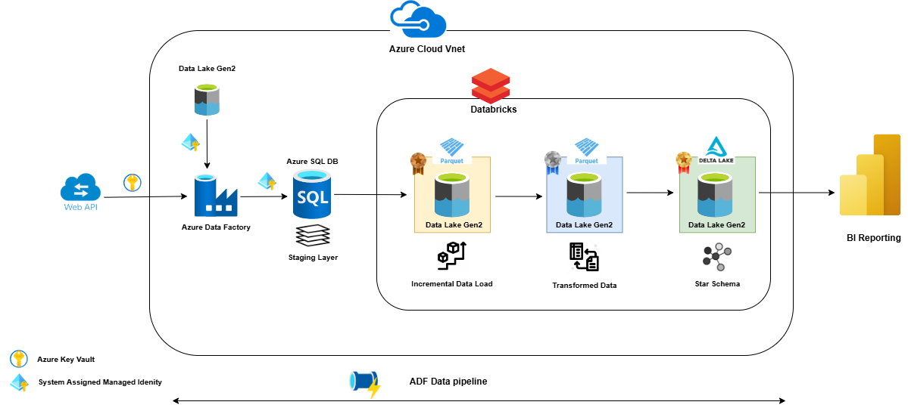

# Car Sales Project
This is the repository for a self learning project called 'Car Sales' wherein I have tried to showcase my learning about Azure Data Engineering Services.

Below are the azure services used in this project:

**For Storage**
- Azure Data Lake Gen2 (Files stored in parquet format)
- Azure Delta Lake (Data stored in Delta format)

**Data Ingestion**
- Azure Data factory (For reading data from the source and dumping it into bronze layer(Azure Data Lake))

**Data Processing**
- Azure Databricks with unity catalog (For processing and cleaning data while it moves from bronze layer upto gold layer)

**Job Orchestration**
- Azure Data Factory Data Pipeline

### Architecure Diagram

As shown in the architecture diagram, I have build a star schema in the gold layer, which consists of 4 dimesnions, i.e.
- dim_model
- dim_delaer
- dim_branch
- dim_date

 And 1 fact table, i.e.
 - fact_sales

 Below is the start schema diagram and it has been extracted from Azure Databricks using the data lineage capabilty of unity catalog:

 

 And, finally below is the data pipeline wherein I have used Azure Factory Data Pipeline to aorchestrate all the jobs from a single point.
 

